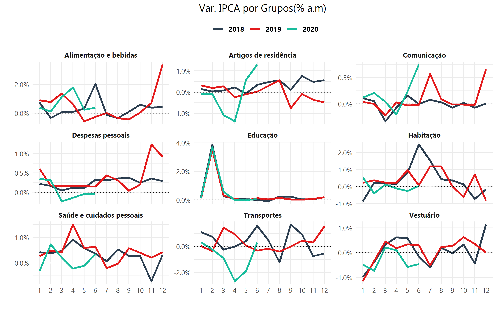
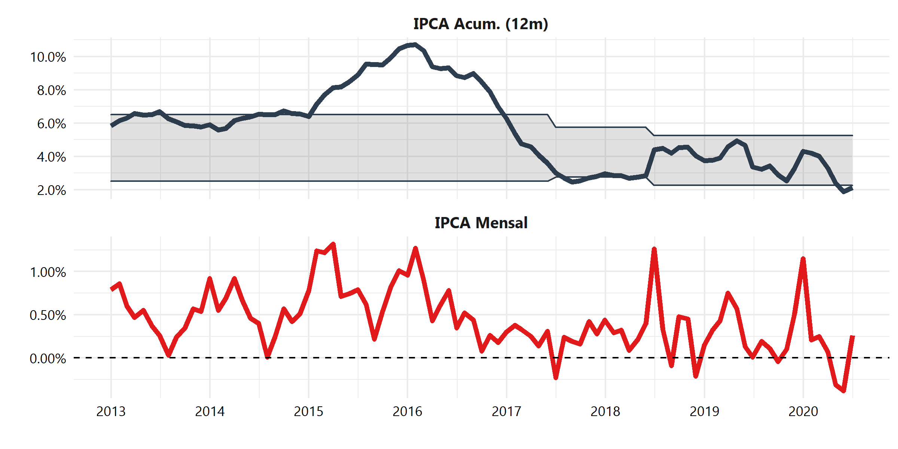
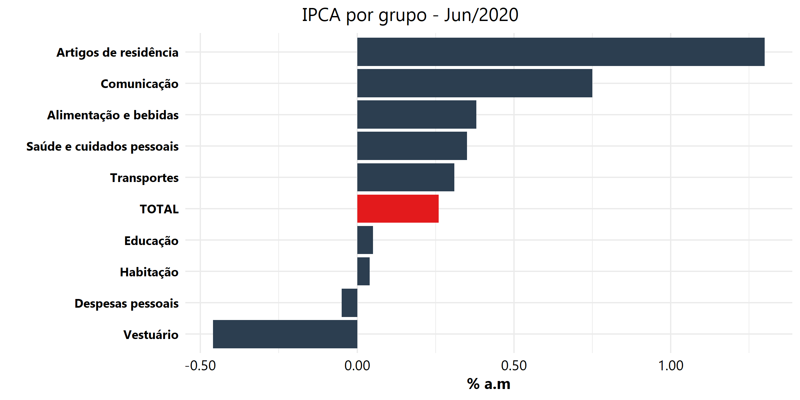

## Monitor IPCA
Este projeto gera um [dashboard interativo](https://augustoleal.shinyapps.io/Monitor_IPCA/) que monitora o **Índice de Preços ao Consumidor Amplo (IPCA)** com dados alimentados diretamente do IBGE através da API SIDRA. O dashboard é atualizado mensalmente de acordo com a API SIDRA e avalia dados desde dez/2012 das séries do IPCA total e de suas  9 composições.

Todo o projeto foi feito com R, guiado pela filosofia do pacote [Golem](https://thinkr-open.github.io/golem/index.html) do [ThinkR](https://github.com/ThinkR-open).

---

Abaixo há as visualizações não-interativas do dashboard

### Visualização 01

### Visualização 02

### Visualização 03

